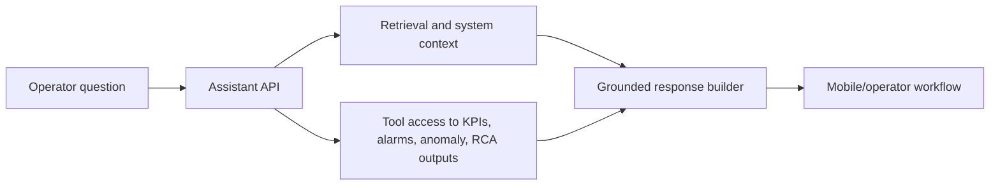

# Operational Analytics Agent

Documentation for an assistant layer built around operational analytics and investigation workflows.

> Proprietary code, internal documents, and internal data are not included. This repository documents the product and architecture at a sanitized level.

## Summary

The Operational Analytics Agent helped operating teams investigate infrastructure signals through grounded retrieval, tool access, system context, and workflow-specific reasoning.

It was designed as an assistant layer attached to monitoring and diagnostics workflows, not as a standalone chatbot.

## Capabilities

- Grounded operational Q&A over internal system context
- Retrieval-assisted investigation
- Tool-style access to platform outputs
- KPI and anomaly explanation support
- RCA summary support
- Assistant flow integrated into mobile/operator-facing product surfaces

## Architecture

## Model Direction

The earliest proof of concept used GPT API calls. Later experimentation moved toward calibrated local model workflows for the internal use case, including DeepSeek R1 exploration.

## Engineering Focus

- Separate assistant UX from model/provider implementation
- Tie answers to platform context and available diagnostic outputs
- Keep the assistant inside investigation workflows
- Link operational summaries to available data

## Tech Stack

Python, FastAPI, retrieval workflows, agent-style orchestration, operational analytics APIs, local model experimentation, Flutter integration.
