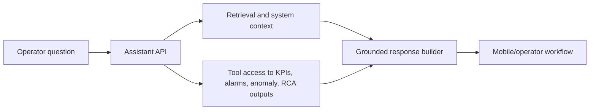

# Operational Analytics Agent

Documentation-only case study for an agent-style investigation layer built around operational analytics workflows.

> Proprietary code, internal documents, and internal data are not included. This repository captures the public-safe product and architecture story.

## Summary

The Operational Analytics Agent was designed to help operating teams investigate infrastructure signals through grounded retrieval, tool use, system context, and workflow-specific reasoning. It sat on top of the monitoring platform and connected users to KPI context, anomalies, RCA outputs, and investigation summaries.

The important engineering idea was not a generic chatbot. It was an assistant layer attached to real operational workflows, with access to structured context and diagnostic tools.

## Capabilities

- Grounded operational Q&A over internal system context
- Retrieval-assisted investigation
- Tool-style access to platform outputs
- KPI and anomaly explanation support
- RCA summary support
- Assistant flow integrated into mobile/operator-facing product surfaces

## Architecture

## Model Direction

The earliest proof of concept used GPT API calls. Later experimentation moved toward calibrated local model workflows for the internal use case, including DeepSeek R1 exploration.

## Engineering Focus

- Separate assistant UX from model/provider implementation
- Avoid ungrounded answers by tying responses to platform context
- Make the assistant useful inside investigation workflows, not as a standalone chat demo
- Keep operational summaries explainable and linked to available data

## Recruiter Signal

This project shows practical AI-enabled software engineering: backend integration, retrieval and tool orchestration, product workflow design, and operational reliability context.

## Tech Stack

Python, FastAPI, retrieval workflows, agent-style orchestration, operational analytics APIs, local model experimentation, Flutter integration.
